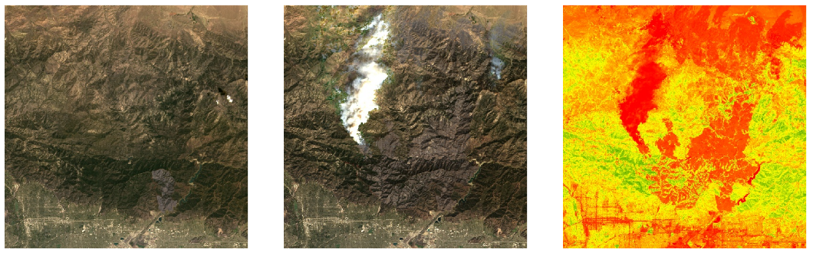

# Introduction to Remote Sensing with Python

Satellites are circling our planet, allowing us to "sense" things about the Earth. It is the art and science of making measurements using sensors. Remote sensing has thus become a valuable tool in research and applications in a wide range of disciplines, such as engineering, geology, geography, urban planning, public health, archeology, environmental studies, disaster research, forestry, and agriculture.

In this workshop, you will:

- learn the basic principles of remote sensing methods in research
- have a hands-on session on using Jupyter Notebooks to code in Python
- import Landsat imagery using Google Earth Engine's Python library
- conduct a basic NDVI (Normalized Difference Vegetation Index) analysis

While there are no prerequisites to take this workshop, participants are encouraged to come with a Google Earth Engine account, which can be obtained here:

https://earthengine.google.com/

# Jupyter Hub link for UCLA participants

If you have a @ucla.edu account:

- Choose "University of California, Los Angeles" from the drop down for "Identity Provider" and launch (just type "UCLA" in the search box).

If you have a @g.ucla.edu account:

- Choose "Google" and launch.

- [UCLA JupyterHub](https://jupyter.idre.ucla.edu/hub/user-redirect/git-pull?repo=https%3A%2F%2Fgithub.com%2Fyohman%2Fworkshop-remote-sensing&urlpath=lab%2Ftree%2Fworkshop-remote-sensing%2FRemote+Sensing+Camp.ipynb&branch=main)

# Binder link to non-UCLA participants

Warning: Launching the binder link will take about 5 minutes.

